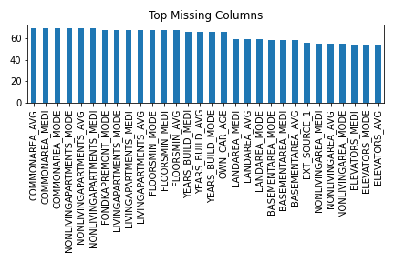
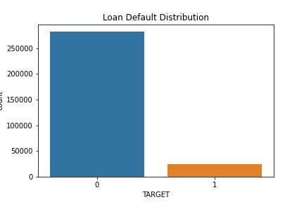
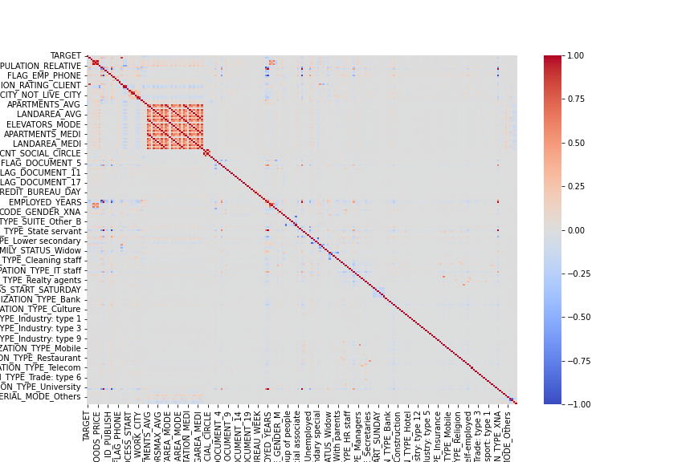
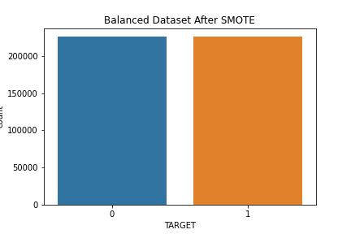
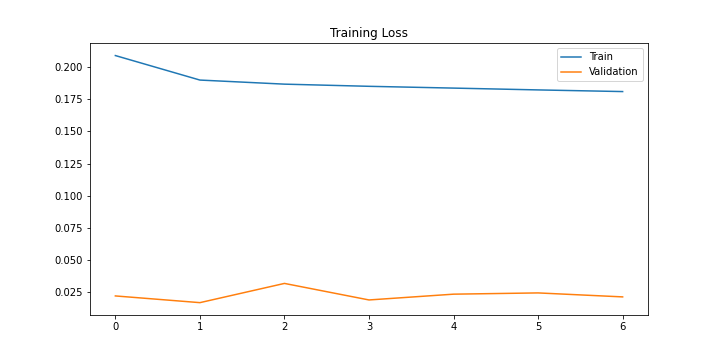
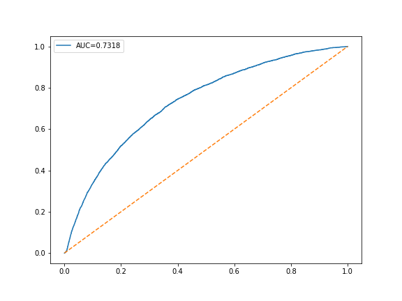
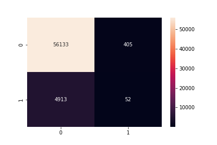

# 🏦 Home Credit Default Risk Prediction using Deep Learning


## 📌 Project Overview

Financial institutions face significant risks when issuing loans. One of the most important challenges is identifying applicants who are likely to default on their loans. Accurate prediction of loan defaults helps banks reduce financial losses and improve credit risk management.

This project develops a **Deep Learning-based Credit Risk Prediction System** using the **Home Credit Default Risk Dataset**. The model analyzes applicant demographics, financial information, employment details, housing information, and credit bureau records to predict whether a customer is likely to default on a loan.

The project demonstrates a complete end-to-end Machine Learning and Deep Learning workflow including:

* Data Cleaning
* Missing Value Analysis
* Exploratory Data Analysis (EDA)
* Feature Engineering
* Class Imbalance Handling using SMOTE
* Feature Scaling
* Deep Learning Model Development
* Model Evaluation
* ROC-AUC Analysis
* Sensitivity (Recall) Analysis

---

# 🎯 Problem Statement

For a safer lending process, financial institutions need reliable methods to identify high-risk customers before approving loans.

The objective of this project is to build a predictive model capable of determining whether a loan applicant is likely to default based on historical customer information.

### Target Variable

| Value | Meaning      |
| ----- | ------------ |
| 0     | Loan Repaid  |
| 1     | Loan Default |

---

# 📂 Dataset Information

Dataset: Home Credit Default Risk

### Dataset Characteristics

* Total Records: **307,511**
* Total Features: **122**
* Problem Type: **Binary Classification**
* Domain: **Finance / Credit Risk Analytics**

The dataset contains information related to:

* Customer demographics
* Income details
* Loan amount information
* Employment history
* Housing information
* Credit bureau inquiries
* Previous credit records
* Social circle information

---

# 🛠 Technologies Used

### Programming Language

* Python

### Data Analysis

* Pandas
* NumPy

### Data Visualization

* Matplotlib
* Seaborn

### Machine Learning

* Scikit-Learn

### Class Imbalance Handling

* SMOTE (Synthetic Minority Oversampling Technique)

### Deep Learning

* TensorFlow
* Keras

### Development Environment

* Jupyter Notebook

---

# 📊 Exploratory Data Analysis

The dataset was analyzed to understand:

* Missing values
* Class imbalance
* Correlation between variables
* Income distributions
* Credit distributions
* Customer age patterns

---

## Missing Value Analysis

Several variables contained missing values. Missing percentages were calculated and columns with excessive missing values were removed.



---

## Target Class Distribution

The dataset contains a highly imbalanced target variable where non-default cases significantly outnumber default cases.



---

# ⚙️ Feature Engineering

To improve predictive performance, several new features were created.

### Age of Customer

```python
AGE_YEARS = abs(DAYS_BIRTH) / 365
```

### Employment Duration

```python
EMPLOYED_YEARS = abs(DAYS_EMPLOYED) / 365
```

### Credit-to-Income Ratio

```python
CREDIT_INCOME_RATIO = AMT_CREDIT / AMT_INCOME_TOTAL
```

### Annuity-to-Income Ratio

```python
ANNUITY_INCOME_RATIO = AMT_ANNUITY / AMT_INCOME_TOTAL
```

### Credit-to-Annuity Ratio

```python
CREDIT_ANNUITY_RATIO = AMT_CREDIT / AMT_ANNUITY
```

These engineered features provide additional financial insights and improve the model's ability to distinguish between low-risk and high-risk applicants.

---

# 🔍 Correlation Analysis

Correlation analysis was performed to identify relationships between numerical variables and the target variable.



---

# ⚖️ Class Imbalance Handling

The Home Credit dataset contains a significant class imbalance.

To address this issue, **SMOTE (Synthetic Minority Oversampling Technique)** was applied to generate synthetic samples for the minority class.

Benefits:

* Improves recall
* Reduces model bias toward majority class
* Enhances sensitivity for default prediction



---

# 🧠 Deep Learning Model

A Deep Neural Network was developed using TensorFlow and Keras.

### Architecture

Input Layer

⬇

Dense Layer (256 Neurons, ReLU)

⬇

Batch Normalization

⬇

Dropout (0.3)

⬇

Dense Layer (128 Neurons, ReLU)

⬇

Batch Normalization

⬇

Dropout (0.3)

⬇

Dense Layer (64 Neurons, ReLU)

⬇

Dropout (0.2)

⬇

Dense Layer (32 Neurons, ReLU)

⬇

Output Layer (Sigmoid)

---

## Model Configuration

### Optimizer

Adam

### Loss Function

Binary Crossentropy

### Evaluation Metrics

* Accuracy
* Precision
* Recall (Sensitivity)
* F1 Score
* ROC-AUC

---

# 📈 Model Training

Early stopping was used to prevent overfitting and improve generalization.



---

# 📉 ROC Curve

Receiver Operating Characteristic (ROC) analysis was performed to evaluate classification performance across different threshold values.



---

# 📋 Confusion Matrix

The confusion matrix provides a detailed view of classification performance.



---

# 🏆 Results

The model was evaluated using multiple performance metrics.

| Metric               | Score |
| -------------------- | ----- |
| Accuracy             | XX.XX |
| Precision            | XX.XX |
| Recall (Sensitivity) | XX.XX |
| F1 Score             | XX.XX |
| ROC-AUC              | XX.XX |

> Replace the values above with your actual model results after training.

---

# 🚀 Project Workflow

1. Data Loading
2. Data Understanding
3. Missing Value Analysis
4. Data Cleaning
5. Feature Engineering
6. Correlation Analysis
7. One-Hot Encoding
8. Train-Test Split
9. SMOTE Balancing
10. Feature Scaling
11. Deep Learning Model Development
12. Model Training
13. Performance Evaluation
14. ROC-AUC Analysis
15. Model Saving

---

# 📁 Project Structure

```text
home-credit-default-risk/
│
├── data/
│   ├── Data_Dictionary.csv
│
├── notebooks/
│   └── Home_Credit_Default_Risk_Full_Notebook.ipynb
│
├── images/
│   ├── age_vs_default.png
│   ├── class_distribution.png
│   ├── confusion_matrix.png
│   ├── correlation_heatmap.png
│   ├── credit_distribution.png
│   ├── income_distribution.png
│   ├── missing_values.png
│   ├── roc_curve.png
│   ├── smote_balance.png
│   └── training_history.png
│
├── models/
│
├── requirements.txt
├── README.md
├── LICENSE
└── .gitignore
```

---

# 📦 Installation

Clone the repository:

```bash
git clone https://github.com/sammysamad402/home-credit-default-risk.git
```

Move into project directory:

```bash
cd home-credit-default-risk
```

Install dependencies:

```bash
pip install -r requirements.txt
```

Launch Jupyter Notebook:

```bash
jupyter notebook
```

Open:

```text
Home_Credit_Default_Risk_Full_Notebook.ipynb
```

---

# ⚠ Dataset Notice

The original `loan_data.csv` dataset is not included in this repository due to GitHub file size limitations.

To run this project:

1. Download the dataset.
2. Place `loan_data.csv` inside the `data/` directory.
3. Run the notebook.

---

# 🔮 Future Improvements

* Hyperparameter Optimization
* XGBoost Comparison
* LightGBM Comparison
* SHAP Explainability
* Streamlit Deployment
* Ensemble Learning Techniques
* Automated Feature Selection

---

# 👨‍💻 Author

**Abdul Samad Shaikh**

Bachelor of Engineering -I.T

Aspiring Data Scientist | Machine Learning Enthusiast | Deep Learning Practitioner

GitHub: https://github.com/sammysamad402

---

# 📜 License

This project is licensed under the MIT License.
